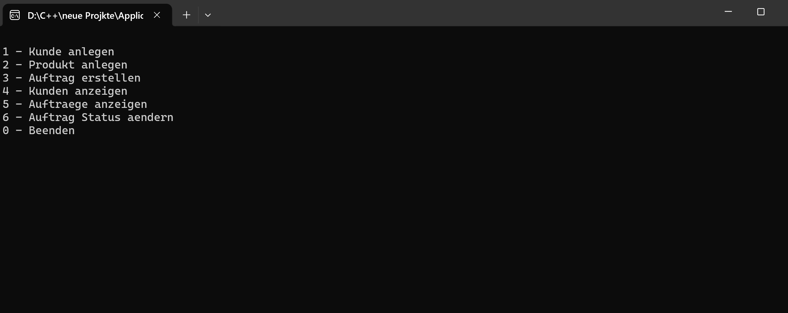
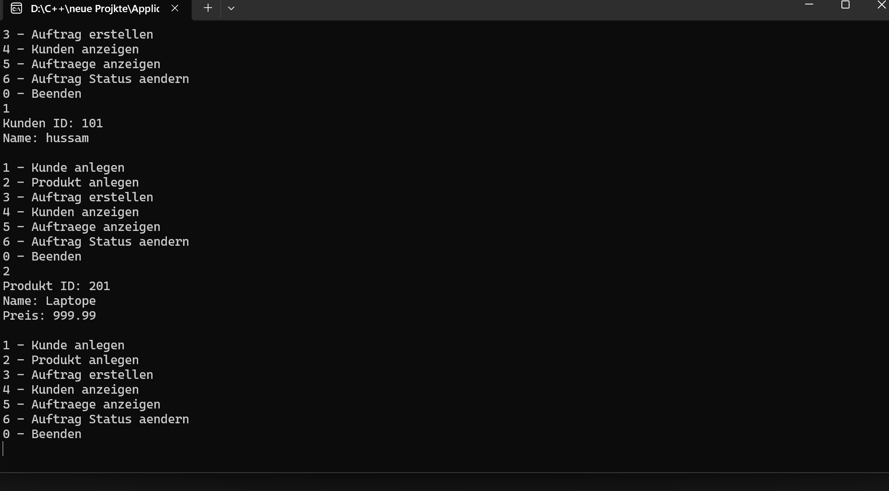
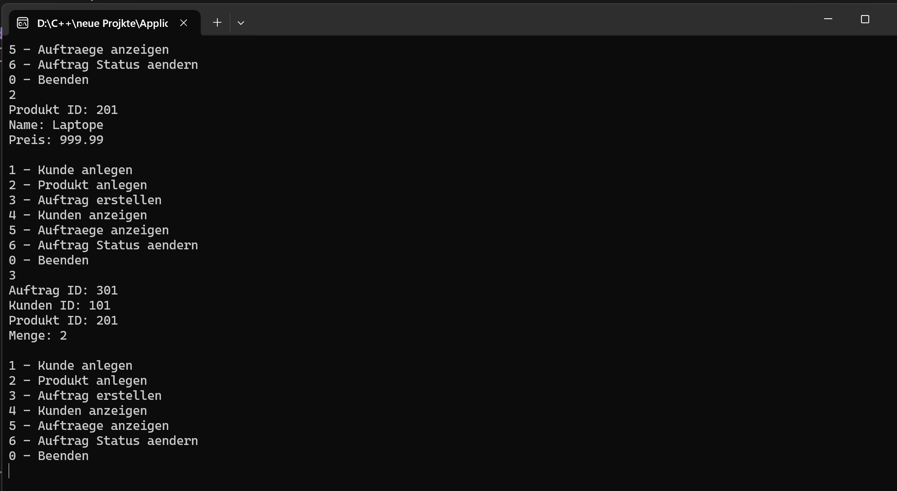
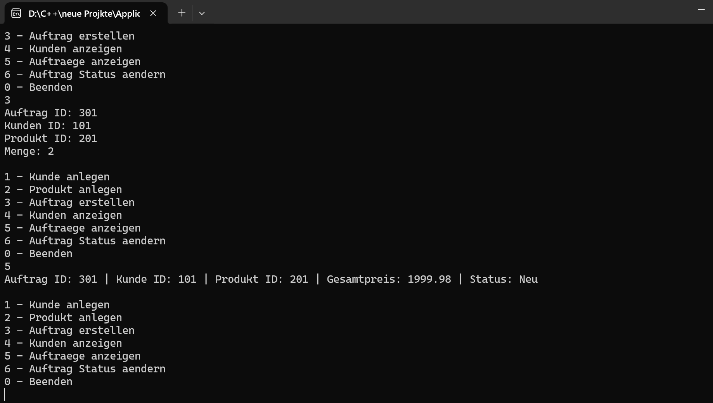

# 🧾 KundenAuftragssystem – C++ Console Application 🏢

Ein interaktives **C++ Konsolenprojekt**, das grundlegende **ERP-Prozesse** (Kunden- & Auftragsverwaltung) simuliert und als Vorbereitung auf die **SAP-Anwendungsentwicklung (ABAP)** dient, mit Fokus auf **strukturierte, modulare und wartbare Programmierung**.

---

## **1️⃣ Ziel des Projekts**

Dieses Projekt wurde entwickelt, um zentrale Programmierkonzepte in **C++** praxisnah zu demonstrieren und die **Grundlagen der ERP-Prozesse**, wie sie in **SAP-Anwendungen** vorkommen, zu veranschaulichen:

- Verwaltung von Kunden, Produkten und Aufträgen  
- Auftragsstatus und Preisberechnung  
- Interaktive Menüsteuerung über die Konsole  
- Strukturierte, modulare Programmierung zur Vorbereitung auf ABAP

**Ziel:**  
Darstellung von **sauberem, strukturiertem und wiederverwendbarem Code**, der die Fähigkeiten des Entwicklers im Bereich der **ERP- und SAP-Programmierung** verdeutlicht.

---

## **2️⃣ Projektbeschreibung**

- Der Benutzer kann:  
  - Kunden hinzufügen  
  - Produkte hinzufügen  
  - Aufträge erstellen  
  - Kunden und Aufträge anzeigen  
  - Auftragsstatus ändern

- Das System speichert bis zu **10 Kunden, Produkte und Aufträge** in Arrays.  
- Gesamtpreisberechnung und Auftragsstatus werden automatisch aktualisiert.  
- Menüführung erfolgt über eine **interaktive Konsole**, ähnlich einfachen ERP-Prozessen.

---

## **3️⃣ Funktionsübersicht**

| Funktion | Zweck |
|--------|------|
| `addKunde()` | Fügt einen neuen Kunden hinzu |
| `addProdukt()` | Fügt ein neues Produkt hinzu |
| `createAuftrag()` | Erstellt einen neuen Auftrag |
| `showKunden()` | Zeigt alle Kunden an |
| `showAuftraege()` | Zeigt alle Aufträge an |
| `changeAuftragStatus()` | Ändert den Status eines Auftrags |
| `PrintMenue()` | Zeigt das Hauptmenü an und steuert den Ablauf |

---

## **🔧 Verwendete Technologien**

- Programmiersprache: C++  
- Entwicklungsumgebung: Visual Studio / Code::Blocks  
- Paradigma: Prozedurale Programmierung  
- Plattform: Windows (Konsole)  

---

## **4️⃣ Code-Beispiel**

```cpp
struct Auftrag
{
    int auftragId;
    int kundenId;
    int produktId;
    int menge;
    double gesamtPreis;
    AuftragsStatus status;
};

// Dies ist nur ein Ausschnitt des Codes.
// Der vollständige Code befindet sich im Projektordner.

## **5️⃣ Screenshots**

Die Screenshots veranschaulichen den vollständigen Ablauf des Programms:

- **Menüansicht**  


- **Kunde hinzufügen**  


- **Produkt hinzufügen**  


- **Auftrag erstellen**  


- **Aufträge anzeigen**  


---

## **6️⃣ Herausforderungen & erworbene Fähigkeiten**

✅ Strukturierte und modulare Programmierung  
✅ Einsatz von Enums und Structs zur Datenmodellierung  
✅ Berechnung und Verwaltung von Aufträgen  
✅ Benutzerinteraktion über Menüsteuerung  
✅ Saubere Trennung von Logik, Eingabe und Ausgabe  
✅ Entwicklung einer vollständigen, lauffähigen Anwendung  

---

## **7️⃣ Fazit**

Dieses Projekt demonstriert meine Fähigkeit, **strukturierte C++ Konsolenanwendungen** zu entwickeln, mit besonderem Fokus auf:

- Übersichtliche und nachvollziehbare Logik  
- Wiederverwendbaren und modularen Code  
- Saubere Trennung von Daten und Programmablauf
